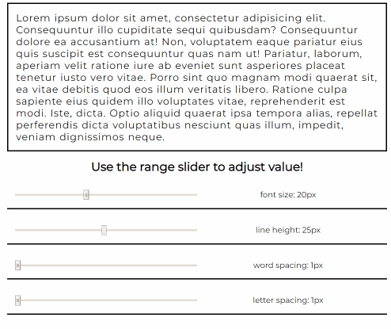

# JS30-03-font adjuster



[Back to home page](https://ming-yong.github.io/JS30/)

## User stories

- **User story #1:** I can adjust font size using a range slider.
- **User story #2:** I can adjust line height using a range slider.
- **User story #3:** I can adjust word spacing using a range slider.
- **User story #4:** I can adjust letter spacing using a range slider.
- **User story #5:** All value will be display beside the slider.
- **User story #6:** Result will be display in a textbox.

## Notes

### Change the value of CSS properties

We create one CSS variable for each of all the properties we want to adjust.

```css
:root {
 --font-size: 20px;
 --line-heigh: 25px;
 --word-spacing: 1px;
 --letter-spacing: 1px;
}

.div_textBox {
 width: 50%;
 border: 2px solid black;
 padding: 1rem;
 font-size: var(--font-size);
 line-height: var(--line-height);
 word-spacing: var(--word-spacing);
 letter-spacing: var(--letter-spacing);
}
```

### Get input from range slider

In HTML, every range slider has an attribute `name` with the CSS property as its value.

```js
<div class="div_valueBox">
 <input type="range" min="1" max="50" value="20" name="font-size" class="input" />
 <div class="div_value">
  font size: <span class="span_fontSize">20</span>px
 </div>
</div>
```

In JavaScript, we listen for an `input` event on each slider.

```js
const inputs = document.querySelectorAll(".div_valueBox input");

function handleUpdate() {
 document.documentElement.style.setProperty(`--${this.name}`, this.value + "px");
}
//For example,
//<input type="range" min="1" max="50" value="20" name="font-size" class="input" />
//in this case will set --font-size to 20

inputs.forEach(input => input.addEventListener("input", handleUpdate));
```

### Change the display value

Whenever there is an input, we update the content in the `span`.

```js
const span_fontSize = document.querySelector(".span_fontSize");
const span_lineHeight = document.querySelector(".span_lineHeight");
const span_wordSpacing = document.querySelector(".span_wordSpacing");
const span_letterSpacing = document.querySelector(".span_letterSpacing");

function outputValue() {
 switch (this.name) {
  case "font-size":
   span_fontSize.textContent = this.value;
   break;
  case "line-height":
   span_lineHeight.textContent = this.value;
   break;
  case "word-spacing":
   span_wordSpacing.textContent = this.value;
   break;
  case "letter-spacing":
   span_letterSpacing.textContent = this.value;
   break;
 }
}

inputs.forEach(input => input.addEventListener("input", outputValue));
```
