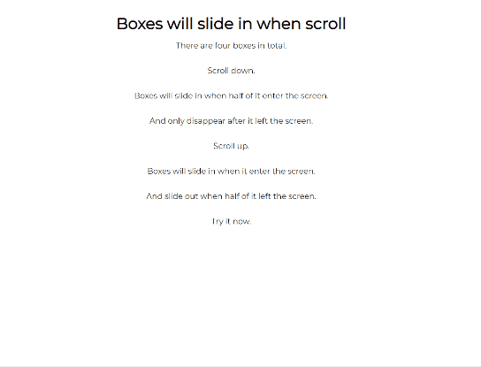

# 13-slide-in-on-scroll



[Back to home page](https://ming-yong.github.io/JS30/)

## User stories

- **User story #1:** I can see boxes slide in when I scroll down.
- **User story #2:** I can see boxes slide out when I scroll up.

## Notes

### Slide in/out boxes

We gave the boxes an opacity of 0 and moved them off 30% left/right depends on the direction we want it to enter. To slide it in, we change the opacity to 1 and moved the boxes back to 0% position.

```css
/*
This is what a box looks like in HTML:
<div class="box slide-in from-right"></div>
*/
.slide-in {
 opacity: 0;
 transition: all 0.5s;
}

.from-left {
 transform: translateX(30%) scale(0.95);
}

.from-right {
 transform: translateX(-30%) scale(0.95);
}

.active {
 opacity: 1;
 transform: translateX(0%) scale(1);
}
```

### Slide the boxes only when half of it entered the screen

The tutorial introduces a function `debounce` to prevent calling the function too many times.

```js
//only call the function so often to avoid performance issue
function debounce(func, wait = 10, immediate = true) {
 var timeout;
 return function() {
  var context = this,
   args = arguments;
  var later = function() {
   timeout = null;
   if (!immediate) func.apply(context, args);
  };
  var callNow = immediate && !timeout;
  clearTimeout(timeout);
  timeout = setTimeout(later, wait);
  if (callNow) func.apply(context, args);
 };
}
```

Whenever user scroll, we add the CSS class `active` to slide the boxes in depends on whether half of the box enter the screen.

```js
const boxes = document.querySelectorAll(".box");

function checkSlide() {
 boxes.forEach(box => {
  //slide in when the half of the box enter the screen
  //window.scrollY = the top of the screen
  //+window.innerHeight = the bottom fo the screen
  //-box.clientHeight/2 = the bottom of the screen is at half of the box's height
  const slideInAt = window.scrollY + window.innerHeight - box.clientHeight / 2;
  //bottom of the box
  //box.offsetTop = the distance from top of the screen to the top of the box
  //+box.clientHeight = the bottom of the box
  const boxBottom = box.offsetTop + box.clientHeight;
  //the point we want to boxes to slide in
  //is greater than
  //distance between the top of the screen and the top of the box
  const isHalfShown = slideInAt > box.offsetTop;
  //the top of the screen
  //is smaller than
  //the bottom of the box
  const isNotScrollPast = window.scrollY < boxBottom;
  if (isHalfShown && isNotScrollPast) {
   box.classList.add("active");
  } else {
   box.classList.remove("active");
  }
 });
}

window.addEventListener("scroll", debounce(checkSlide));
```
