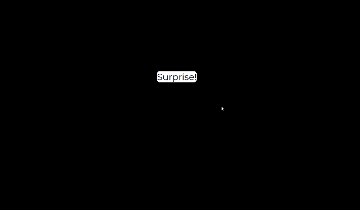

# 22-flashlight



[Back to home page](https://ming-yong.github.io/JS30/)

## User stories

- **User story #1:** In a black background page, I can see the links when my mouse hover over it.

## Notes

### Add CSS when hover over links

We want to layer a `span` with class `flashlight` under the link that the cursor touches.

In CSS:

```css
.flashlight {
 transition: all 0.2s;
 border-bottom: 2px solid white;
 position: absolute;
 top: 0;
 background: white;
 left: 0;
 z-index: -1;
 border-radius: 10px;
 display: block;
}
```

In JavaScript:

```js
//select all the links
const links = document.querySelectorAll("a");
//create a span with class "flashlight and append to body"
const flashlight = document.createElement("span");
flashlight.classList.add("flashlight");
document.body.append(flashlight);

function flashlightOn() {
 //get the coordinate of the link
 const linkCoords = this.getBoundingClientRect();
 //when scroll, update the top and left
 const coords = {
  width: linkCoords.width,
  height: linkCoords.height,
  top: linkCoords.top + window.scrollY,
  left: linkCoords.left + window.screenX
 };
 //layer the span under the link
 flashlight.style.width = `${coords.width}px`;
 flashlight.style.height = `${coords.height}px`;
 flashlight.style.transform = `translate(${coords.left}px,${coords.top}px)`;
}

links.forEach(link => link.addEventListener("mouseenter", flashlightOn));
```
