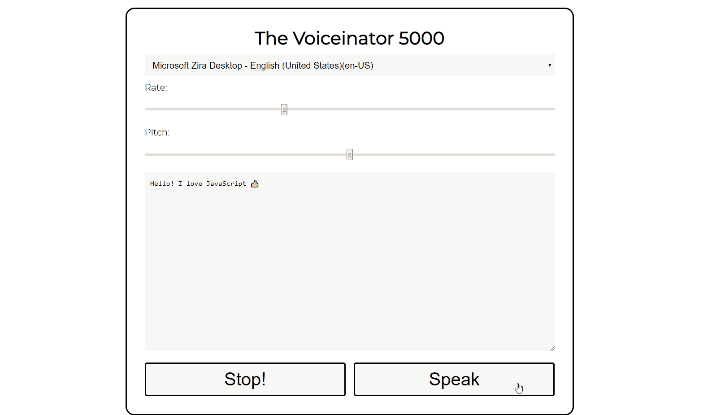

# 23-speech-synthesis



[Back to home page](https://ming-yong.github.io/JS30/)

## User stories

- **User story #1:** I can select the desired voice using a drop down.
- **User story #2:** I can adjust the speech rate and pitch with range slider.
- **User story #3:** I can type custom speech in the textbox.
- **User story #4:** I can play or stop the speech with corresponding button.
- **User story #5:** The speech will be play immediately after I made any changes.

## Notes

### Setting up the dropdown options

When `speechSynthesis` load up, it fires a `voiceschanged` event. Set up the dropdown options when it loaded.

```js
//create an instance
const message = new SpeechSynthesisUtterance();
//array of all the voice options
let voices = [];
const voicesDropdown = document.querySelector('[name="voice"]');
//select two range sliders, buttons and a text box
const options = document.querySelectorAll('[type="range"], [name="text"]');
const speakButton = document.querySelector("#btn_speak");
const stopButton = document.querySelector("#btn_stop");
const displayOption = document.querySelector("#option_display"); //the option we display inside the dropdown
message.text = document.querySelector('[name="text"]').value; //text in the textbox is the content of our speech

function populateVoices() {
 //get all the voice options that browser supports and put them into the array
 voices = this.getVoices();
 //set each of them as option inside the dropdown
 voicesDropdown.innerHTML = voices
  // .filter(voice => voice.lang.includes("en"))
  .map(voice => `<option value="${voice.name}">${voice.name}(${voice.lang})</option>`)
  .join("");
 //display the current voice.name in the dropdown box
 displayOption.value = voice.name;
}

speechSynthesis.addEventListener("voiceschanged", populateVoices);
```

### Select and change the voice

When user picks another voice, we replay the speech with their input value.

```js
function setVoice() {
 message.voice = voices.find(voice => voice.name === this.value); //set the voice to user's pick
 toggle();
}

function toggle(startOver = true) {
 speechSynthesis.cancel(); //stop everything
 if (startOver) {
  speechSynthesis.speak(message);
 }
}

voicesDropdown.addEventListener("change", setVoice);
```

### Adjust the pitch and rate

`options` can be the text, the rate or the pitch.

```js
function setOption() {
 message[this.name] = this.value;
 toggle();
}

options.forEach(option => option.addEventListener("change", setOption));
```

### Play and stop the voice

We use `startOver` as a flag in `toggle`.

```js
speakButton.addEventListener("click", toggle);
stopButton.addEventListener("click", () => toggle(false)); //another way: toggle.bind(null,false)
```
