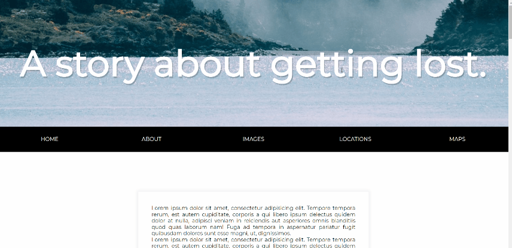

# 24-sticky-nav



[Back to home page](https://ming-yong.github.io/JS30/)

## User stories

- **User story #1:** When the nav bar hits the top of the page, it becomes fixed.

## Notes

### Fixed nav bar

When the position of the top of the nav bar is smaller than the viewport's Y coordinate when scroll, fix the nav.

```js
const nav = document.querySelector("#main");
const topOfNav = nav.offsetTop; //the top of the nav bar

function fixNav() {
 //compare the Y coordinate of the viewport with the top of the nav bar
 if (window.scrollY >= topOfNav) {
  document.body.style.paddingTop = nav.offsetHeight + "px"; //add "nav bar's height" of padding so content stays still
  document.body.classList.add("fixed-nav"); //gives nav bar a position fixed
 } else {
  document.body.style.paddingTop = 0; //no padding needed
  document.body.classList.remove("fixed-nav"); //no fixed position needed
 }
}

window.addEventListener("scroll", fixNav);
```

In CSS:

```css
body.fixed-nav nav {
 position: fixed;
 box-shadow: 0 5px 0 rgba(0, 0, 0, 0.1);
}
```

### Slide in logo and content zoom in

When nav bar is fixed, we would also want to slide in the logo and zoom in the content. We can't animate `width:0` to `width:auto`, therefore a `max-width` is needed.

```css
/*Sliding logo*/
li.logo {
 max-width: 0;
 overflow: hidden;
 background: white;
 transition: all 0.5s;
 font-weight: 600;
 font-size: 30px;
}

.fixed-nav li.logo {
 max-width: 500px;
}

/*Zooming text*/
.div_site-wrap {
 transform: scale(0.98);
 transition: transform 0.5s;
}

body.fixed-nav .div_site-wrap {
 transform: scale(1);
}
```
