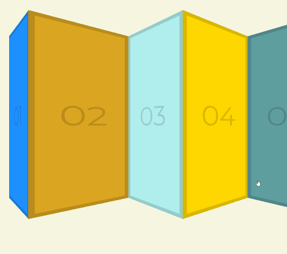

# 27-click-drag-scroll



[Back to home page](https://ming-yong.github.io/JS30/)

## User stories

- **User story #1:** I can click and drag the cards to scroll.
- **User story #2:** when my mouse left the page or up, the cards will not be scroll.

## Notes

### Should we scroll

We use `isDown` as a flag to determines whether we should allow scrolling.

```js
const slider = document.querySelector(".items");
let isDown = false;
let startX;
let scrollLeft;

slider.addEventListener("mousedown", e => {
 isDown = true;
 slider.classList.add("active"); //the pop up effect when clicked
 startX = e.pageX - slider.offsetLeft; //make sure we are clicking the div
 scrollLeft = slider.scrollLeft; //starting point for X when click
});

slider.addEventListener("mouseleave", () => {
 isDown = false;
 slider.classList.remove("active");
});

slider.addEventListener("mouseup", () => {
 isDown = false;
 slider.classList.remove("active");
});
```

A CSS class `active` will be added if allow:

```css
.items.active {
 background: rgba(255, 255, 255, 0.3);
 cursor: grabbing;
 cursor: -webkit-grabbing;
 transform: scale(1);
}
```

### Scroll

Do the math to calculate how far we should scroll:

When user drags, `slider.scrollLeft = scrollLeft - walk`, where:

- `slider.scrollLeft` is the number of pixels that `slider` is scrolled from its left edge.
- `scrollLeft` is the initial `slider.scrollLeft` value when user clicks.
- `walk` = `x`(the current X coordinate) - `startX`(the initial X coordinate).

```js
slider.addEventListener("mousemove", e => {
 if (!isDown) return; //stop the function from running
 e.preventDefault(); //avoid selecting other element
 const x = e.pageX - slider.offsetLeft; //changing X when drag
 const walk = (x - startX) * 3; //how many X do we move, every pixel moves, scroll the slider three pixels
 slider.scrollLeft = scrollLeft - walk;
});
```
