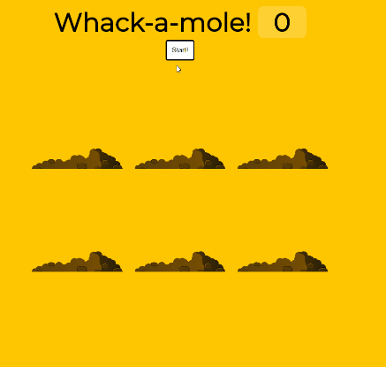

# JS30-30-whack-a-mole



[Back to home page](https://ming-yong.github.io/JS30/)

## User stories

- **User story #1:** I can start a game by click the "start" button.
- **User story #2:** I got a score every time I click on a mole.
- **User story #3:** I can see my updated score in the scoreboard which is right beside the game title.
- **User story #4:** I can start a new round by click the "start" button, score will be reset to zero.

## Notes

### Starting a game

When user clicks the button in HTML `<button onClick="startGame()">Start!</button>`, a `startGame()` function is triggered.

```js
const scoreBoard = document.querySelector(".score"); //the display score
let timeUp = false;
let score = 0;

function startGame() {
 scoreBoard.textContent = 0; //reset the display score to zero
 timeUp = false; //set the countdown flag to false
 score = 0; // reset score to 0
 peep(); //start game
 setTimeout(() => (timeUp = true), 10000); //the countdown flag is true for 10 seconds, in other words, a round lasts 10 seconds
}
```

### Moles from holes

As seen in `startGame()` function, a function `peep()` is called to start animate moles from random holes.

```js
function peep() {
 const time = randomTime(200, 1000); // set a radom time
 const hole = randomHole(holes); // select a random mole
 hole.classList.add("up"); //mole is up
 //mole is down after random time "time"
 setTimeout(() => {
  hole.classList.remove("up");
  if (!timeUp) peep(); // keep calling the next mole if the game is still going
 }, time);
}
```

Here is how function `randomTime()` works:

```js
function randomTime(min, max) {
 return Math.round(Math.random() * (max - min) + min); // generate a random whole number with range (min,max)
}
```

Here is how function `randomHole` works:

```js
const holes = document.querySelectorAll(".hole"); //every hole has a class "hole" in HTML
let lastHole;

function randomHole(holes) {
 const index = Math.floor(Math.random() * holes.length); //random index of "holes"
 const hole = holes[index]; //the selected hole
 if (hole == lastHole) {
  return randomHole(holes); //avoid repeated hole
 }
 lastHole = hole;
 return hole;
}
```

### Hit the mole and score

Now we have our mole working, it's time to add the scoring system.

```js
const moles = document.querySelectorAll(".mole"); //every mole has a class "mole" in HTML

function bonk(e) {
 if (!e.isTrusted) return; //preventing cheater faking clicks
 score++; //increase the score
 this.classList.remove("up"); //mole is down after hit
 scoreBoard.textContent = score; // display the score
}

moles.forEach(mole => mole.addEventListener("click", bonk)); //when user clicks the mole, call "bonk"
```
